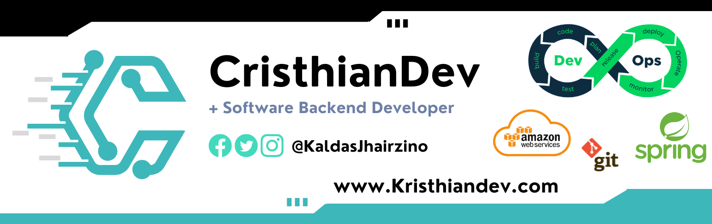

# Microservice with SpringBoot
Microservice development for didactic topics, containing basic topics for the development of a microservice.

## Badges

[](https://github.com/cristhiancaldas/microservices)

[](https://github.com/cristhiancaldas/microservices)

[](https://choosealicense.com/licenses/mit/)

[](https://choosealicense.com/licenses/mit/)


## Contributing

Contributions are always welcome!

See `readme.md` for ways to get started.

Please adhere to this project's `code of conduct`.


## Feedback

If you have any feedback, please reach out to us at c.caldas.m@gmail.com


## Installation

Install my-project with maven

```bash
  mvn clean package
```

## Authors

  
